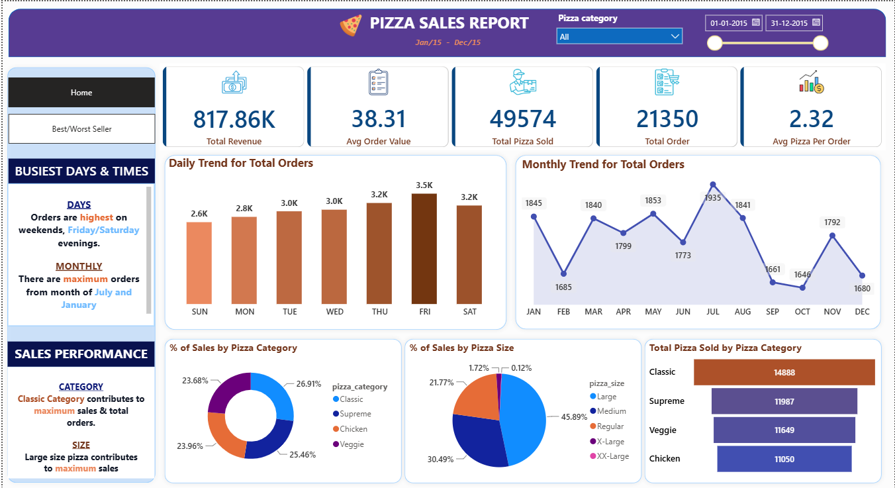
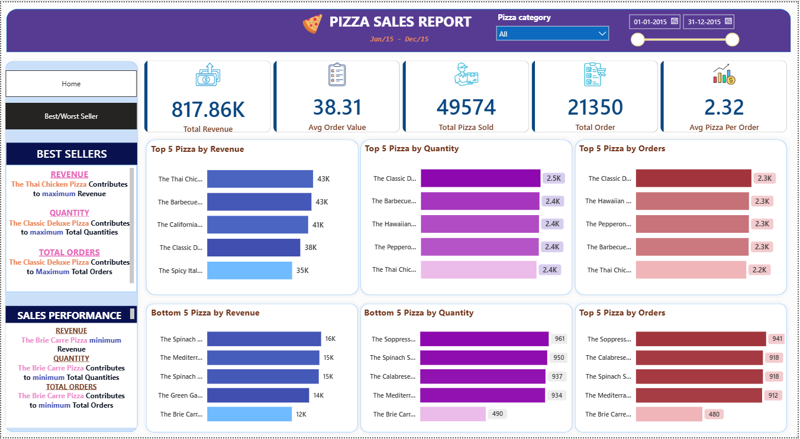

# 🍕 Pizza Sales Analysis Dashboard | SQL & Power BI

An end-to-end Data Analytics project that analyzes one year of pizza sales data using SQL Server and Microsoft Power BI to generate business insights through interactive dashboards.


## 📖 Project Overview

The Pizza Sales Analysis Dashboard is an end-to-end data analytics project that analyzes one year of pizza sales data using SQL Server and Microsoft Power BI.

The project transforms raw sales data into meaningful business insights by calculating key performance indicators (KPIs), analyzing sales trends, and creating interactive dashboards that support data-driven business decisions.


## 🎯 Business Problem

The restaurant collects daily sales transaction data but lacks a centralized reporting system to monitor business performance and identify sales trends. As a result, management finds it difficult to evaluate product performance and make informed business decisions.

This project addresses this challenge by analyzing sales data using SQL and presenting the results through an interactive Power BI dashboard with key performance indicators and business insights.


## 🎯 Project Objectives

- Analyze one year of pizza sales data using SQL Server.
- Calculate key business performance indicators (KPIs).
- Identify daily and monthly sales trends.
- Analyze sales by pizza category and pizza size.
- Identify the best-selling and least-selling pizzas.
- Build an interactive Power BI dashboard for data visualization.
- Generate actionable business insights to support decision-making.


## 🛠️ Tools & Technologies

| Tool | Purpose |
|------|---------|
| Microsoft Excel | Prepared and verified the dataset before importing into SQL Server |
| SQL Server | Stored the dataset for analysis |
| SQL Server Management Studio (SSMS) | Wrote and executed SQL queries |
| SQL | Performed KPI calculations and business analysis |
| Microsoft Power BI | Developed interactive dashboards and visualizations |
| Git & GitHub | Version control and project portfolio |


## 📊 Dataset Information

| Attribute | Details |
|-----------|---------|
| Dataset Name | Pizza Sales Dataset |
| File Formats | CSV (.csv), Excel (.xlsx) |
| Time Period | January 2015 – December 2015 |
| Total Records | 48,620 |
| Total Columns | 12 |
| Data Fields | Order ID, Order Date, Order Time, Pizza Name, Pizza Category, Pizza Size, Quantity, Unit Price, Total Price |
| Dataset Purpose | Analyze pizza sales performance and generate business insights |


## 🔄 Project Workflow

1. Downloaded the raw Pizza Sales dataset in CSV format.
2. Converted the dataset into Microsoft Excel (.xlsx) format.
3. Imported the dataset into SQL Server.
4. Performed data analysis using SQL queries in SSMS.
5. Calculated key business KPIs.
6. Created SQL queries for dashboard visualizations.
7. Connected SQL data to Microsoft Power BI.
8. Designed interactive dashboards with charts, KPIs, and slicers.
9. Generated business insights from the dashboard.
10. Organized the project with documentation and GitHub-ready folder structure.


## 🖼️ Dashboard Preview

The Power BI dashboard provides an interactive view of the restaurant's sales performance through key business metrics, trend analysis, and product performance.

### 🏠 Home Dashboard



---

### 🏆 Best & Worst Sellers Dashboard



## 📈 Key Performance Indicators (KPIs)

The dashboard tracks the following key business metrics to evaluate the restaurant's overall sales performance:

| KPI | Description |
|-----|-------------|
| Total Revenue | Total revenue generated from pizza sales |
| Average Order Value | Average amount spent per customer order |
| Total Pizzas Sold | Total number of pizzas sold |
| Total Orders | Total number of customer orders placed |
| Average Pizzas per Order | Average number of pizzas purchased in each order |


## 📊 Dashboard Features

The Power BI dashboard provides interactive visualizations and business insights through the following features:

- 📌 KPI cards displaying key business metrics.
- 📈 Daily and monthly sales trend analysis.
- 🍕 Sales analysis by pizza category and pizza size.
- 🏆 Top 5 and Bottom 5 pizzas based on revenue, quantity sold, and total orders.
- 🎛️ Interactive slicers for dynamic data filtering.
- 📄 Multi-page dashboard with easy navigation between reports.


## 💡 Business Insights

The analysis of pizza sales data revealed several valuable business insights:

- 📅 **Friday** recorded the highest number of customer orders, indicating increased demand before the weekend.
- 📈 **July** achieved the highest monthly sales activity, while October recorded comparatively lower order volume.
- 🍕 The **Classic** pizza category generated the highest overall sales, making it the best-performing category.
- 📏 **Large-sized pizzas** contributed the highest percentage of total sales, showing strong customer preference.
- 🏆 The dashboard identified both top-performing and underperforming pizzas, enabling data-driven decisions for inventory management, marketing strategies, and menu optimization.


## 📁 Project Folder Structure

```text
Pizza Sales Analysis
│
├── README.md
├── 01_Raw_Data
│   └── Pizza_Sales_Raw.csv
│
├── 02_Cleaned_Data
│   ├── Pizza_Sales_Cleaned.xlsx
│   └── README.md
│
├── 03_SQL
│   ├── 01_KPI_Queries.sql
│   └── 02_Chart_Queries.sql
│
├── 04_PowerBI
│   └── Pizza_Sales_Dashboard.pbix
│
├── 05_Dashboard_Screenshots
│   ├── Home_Dashboard.png
│   ├── Best_Worst_Seller.png
│   └── Other dashboard screenshots
│
└── 06_Documentation
    ├── Business_Problem.docx
    ├── Dataset_Description.docx
    ├── SQL_Explanation.docx
    ├── Dashboard_Explanation.docx
    ├── Business_Insights.docx
    └── Project_Notes.docx
```


## 📚 Learning Outcomes

Through this project, I strengthened my practical skills in:

- Writing SQL queries to analyze business data.
- Calculating key business performance indicators (KPIs).
- Transforming raw data into meaningful business insights.
- Designing interactive dashboards using Microsoft Power BI.
- Applying data visualization best practices for business reporting.
- Organizing a complete end-to-end analytics project for GitHub.


## 🚀 Future Improvements

This project can be further enhanced by implementing the following improvements:

- Develop advanced DAX measures for deeper business analysis.
- Publish the dashboard using Power BI Service for online access and sharing.
- Automate data refresh to support real-time reporting.
- Add sales forecasting to predict future business performance.
- Perform customer segmentation to better understand purchasing behavior.
- Expand the dashboard with additional KPIs and interactive visualizations.


## 👨‍💻 About the Author

**Abhishek Ram**

Aspiring Data Analyst passionate about Data Analytics, Business Intelligence, and Data Visualization. Skilled in SQL, Power BI, Excel, and Python, with a focus on transforming raw data into meaningful business insights.

This project is part of my data analytics portfolio, showcasing my practical skills in data analysis, dashboard development, and business problem-solving through real-world projects.

📧 Email: abhishek97695@gmail.com

🔗 LinkedIn: *(www.linkedin.com/in/abhishek-r-ram)*

💻 GitHub: *(https://github.com/abhishekram20/Pizza-Sales-Analysis.git)*